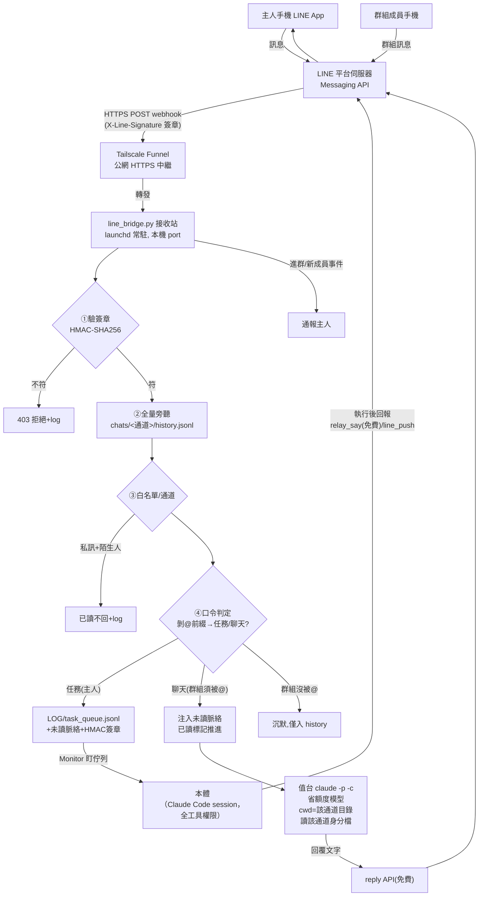

# 架構：一則訊息的一生（客戶版）

> 這套系統做什麼：把一個 LINE 官方帳號變成你的 AI 值台——平常有個助理在 LINE 上回話，
> 「任務」開頭的訊息升級給有完整工具權限的本體執行。零第三方套件、金鑰不出你的機器。

## 總覽圖

## 六個設計重點（為什麼這樣做）

1. **驗簽第一**：每個 webhook 請求先驗 LINE 官方簽章（HMAC-SHA256），驗不過 403——公網網址被掃到也沒關係，沒有金鑰做不出合法簽章
2. **白名單 fail-closed**：私訊只回主人；空白名單時=註冊模式，第一個講認主口令的人成為唯一主人
3. **通道記憶隔離（目錄層）**：每個 LINE 通道（私訊/各群組）一個獨立目錄=獨立對話記憶＋獨立身分檔——私訊內容**結構上**不可能漏進群組，不靠 AI 自律
4. **雙腦分工**：聊天走省額度模型（值台）；「任務」開頭升級到本體（完整權限）——省錢且權限分層
5. **額度精算**：reply 免費不限量、push 200 則/月——回報優先掛「待轉達佇列」搭下一班 reply 便車，push 留給急件
6. **任務封包簽章**：任務佇列每筆帶 HMAC 簽章＋nonce，本體執行前驗章（task_verify.py）——防「只改佇列檔」的偽造路徑

## 元件清單

| 元件 | 角色 |
|---|---|
| `tools/line_bridge.py` | 接收站（webhook 驗簽/白名單/路由/附件閘/佇列） |
| `tools/relay_say.py` | 本體免費出聲路（待轉達佇列） |
| `tools/line_push.py` | 本體主動推送（吃額度，急件用） |
| `tools/task_verify.py` | 任務封包驗章器（本體動手前跑） |
| `tools/queue_backlog_check.py` | 佇列積壓偵測（有任務沒人動=機器判定） |
| `CLAUDE.md` | 值台身分檔母版（自動傳導到各通道） |
| `config/kit_config.json` | 部署參數單一真源（名字/口令/port…） |
| launchd plist | 常駐管家（開機自動、當掉自動重生） |
